# Understand Waiting Time in EIP-1559 Transaction Fee Mechanisms

## Project information
- **Authors**: 
- **Acknowledgments**: This research is supported as an independent project supported by Ethereum Academic Grants Round.
- **Project Summary**: 
Blockchain enables peer-to-peer transactions in cyberspace without a trusted third party. The rapid growth of Ethereum and smart contract blockchains in general — calls for well-designed Transaction Fee Mechanisms (TFMs) to allocate limited storage and computation resources. However, existing research on TFMs needs to consider the waiting time of transactions, which is essential for both computer security and economic efficiency, though often mentioned in different words, such as latency or market congestion. Integrating data from the Ethereum blockchain and mempool, we explore how two types of shocks affect transaction latency. First, we apply regression discontinuity design (RDD) to study the causal inference of the Merge, the most recent significant upgrade of Ethereum. Our results show that the Merge significantly reduces the long waiting time and market congestion. Then, we apply time series analysis to research the interaction of significant NFT drops and market congestion using Facebook Prophet, an open-source algorithm for generating time-series models. Our analysis reveals that the models could significantly improve the forecast of market congestion by considering NFT drops as a shock. Our study contributes to the interdisciplinary research at the intersection of computer security, distributed systems, market design, causal inferences, and time series analysis. Our findings shed light on a new direction of TFMs that prevent market congestion by efficiently forecasting ex-ante other than the current ex-post treatments. 

## Table of Contents
- [data](https://github.com/sunshineluyao/waiting-time-eip1559/tree/main/data)
- [code](https://github.com/sunshineluyao/waiting-time-eip1559/tree/main/code)
- [figs](https://github.com/sunshineluyao/waiting-time-eip1559/tree/main/figs)


## data
```
data
├── Data Source
│   ├── EthereumETL, Etherscan.io, OFAC
│   └── MemopoolGuru
└── Data Product on Kaggle
    ├── Queried Data
    └── Processed Data
```

### The Merge Data Range

|type            | from                | to                  |
|----------------|---------------------|---------------------|
| date_time      | 2022-09-03 20:10:39 |2022-09-25 02:27:11  |
| unix_timestamp |1662235839.0	       |1664072831.0         |
| block number   |15467393	           |15607393             |


### The NFT Data Range
|type              | from                 | to                |
|-----------------|-----------------------|-------------------|
| date_time       |2021-08-04 00:00:00    |2021-09-21 00:00:00|
| unix_timestamp  |1629763200.0           |1632182400.0       |
| block number    |13084679               |13265754           |

### The dictionary of Blockchain Data


### The dictionary of Memopool Data


## code
```
code
├── Data_Analyze
│   ├── Analyze_Data_NFT.ipynb
│   └── Analyze_Data_The_Merge.ipynb
├── Data_Process
│   └── Process_Data.ipynb
└── Data_Query
    ├── Query_Data_EthereumETL_Public.ipynb
    └── Query_Data_MemopoolGuru_Public.ipynb
```

## figs

```
figs
├── Result 1: the merge
│   ├── 1.1. The Waiting Time (delay)
│   │   ├── 1.1.1. Visualizations
│   │   ├── 1.1.2. Moving Average Smoothing
│   │   └── 1.1.3. Regression Discontinuity Design
│   ├── 1.2. The Market Congestion (efficiency)
│   │   ├── 1.2.1. Visualizations
│   │   ├── 1.2.2. Moving Average Smoothing
│   │   └── 1.2.3. Regression Discontinuity Design
│   └── 1.3. The Gas Used Per Second (security)
│        ├── 1.3.1. Visualizations
│        ├── 1.3.2. Moving Average Smoothing
│        └── 1.3.3. Regression Discontinuity Design
│    
└── Result 2. The NFT drops
    ├── 2.1 Visualizations
    └── 2.2. Time Series Forecast
```

### Result 1: the merge

#### 1.1. The Waiting Time (delay)

##### 1.1.1. Visualizations
- Figure 1

HTML: [https://sunshineluyao.github.io/waiting-time-eip1559/figs/merge/fig1](https://sunshineluyao.github.io/waiting-time-eip1559/figs/merge/fig1)
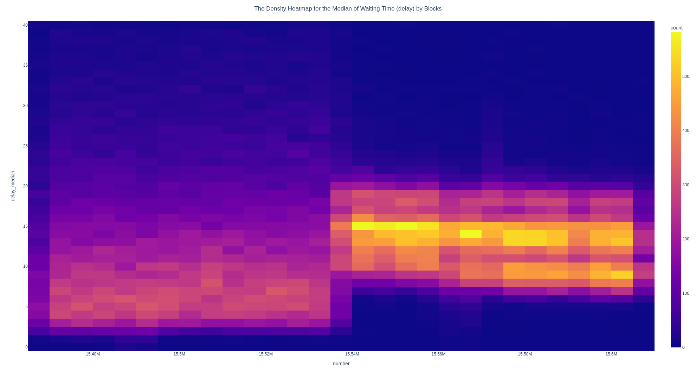
- Figure 2: 

HTML: [https://sunshineluyao.github.io/waiting-time-eip1559/figs/merge/fig2](https://sunshineluyao.github.io/waiting-time-eip1559/figs/merge/fig2)
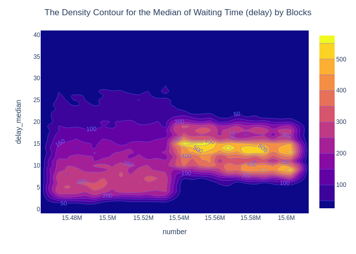

- Figure 3: 

HTML: [https://sunshineluyao.github.io/waiting-time-eip1559/figs/merge/fig3](https://sunshineluyao.github.io/waiting-time-eip1559/figs/merge/fig3)
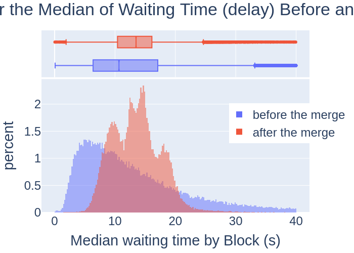
- Figure 4: 

HTML [https://sunshineluyao.github.io/waiting-time-eip1559/figs/merge/fig4](https://sunshineluyao.github.io/waiting-time-eip1559/figs/merge/fig4)
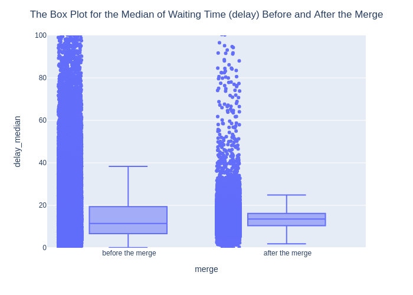

##### 1.1.2. Moving Average Smoothing

- Figure 12:

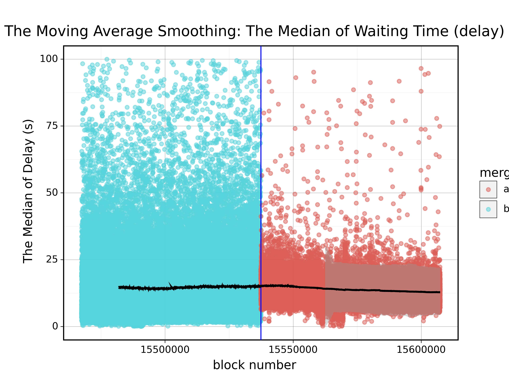


- Figure 13:
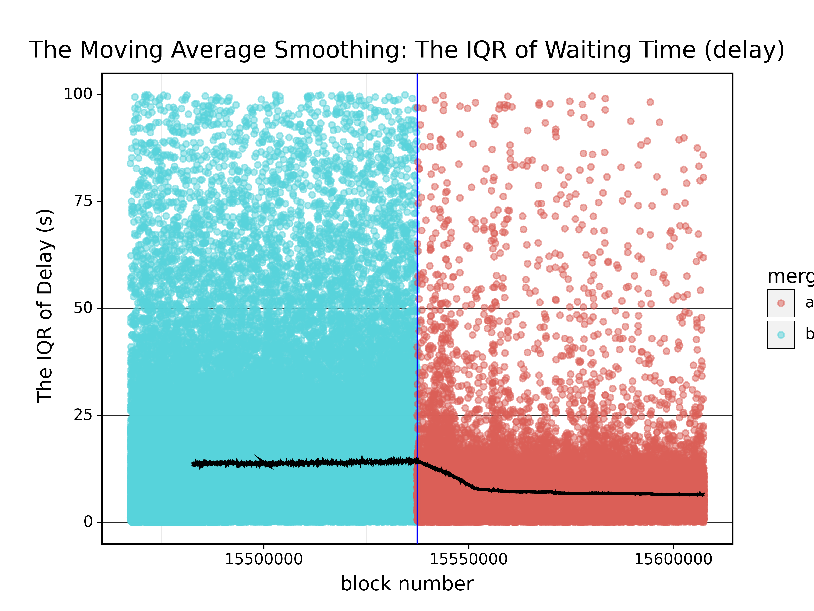

- Figure 14:
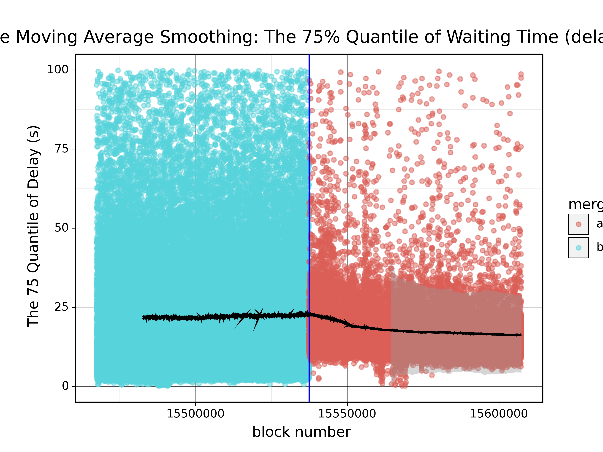


- Figure 16:


##### 1.1.3. Regression Discontinuity Design 

*Tables refer to the paper* 


#### 1.2. The Market Congestion
##### 1.2.1. Visualization
- Figure 10:
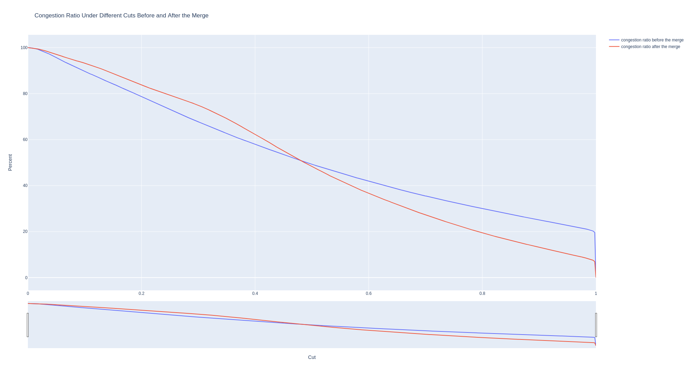

- Figure 11:
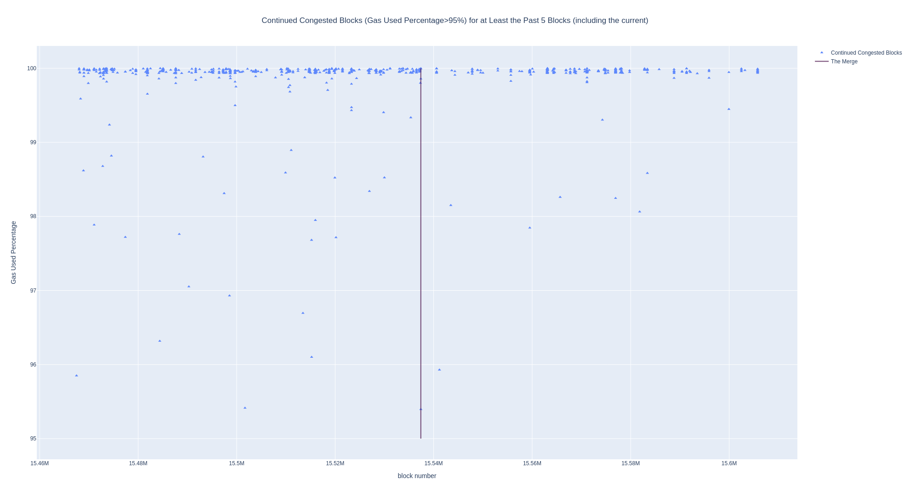

##### 1.2.2. Moving Aveage Smoothing

- Figure 17:
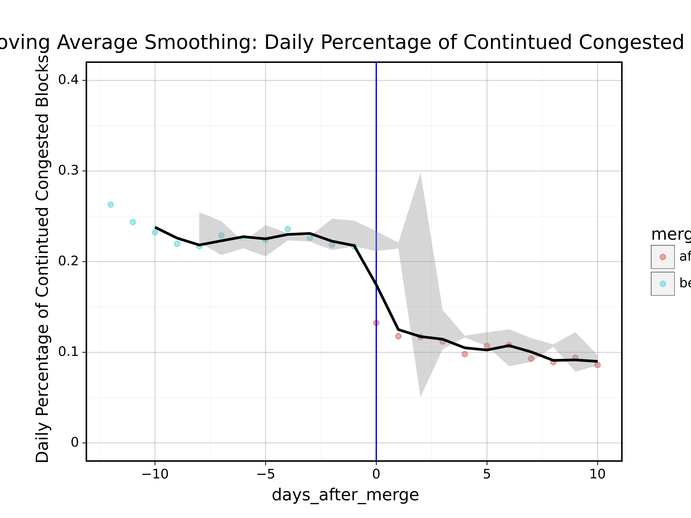

- Figure 18:
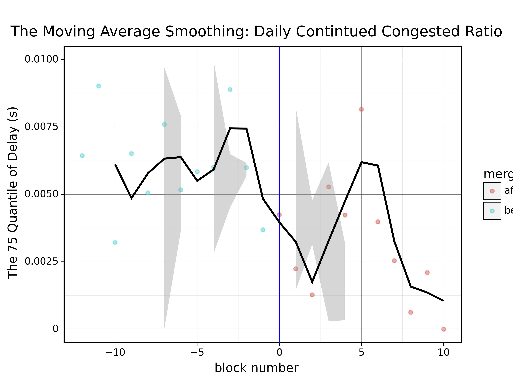

##### 1.2.3. Regression Discontinuity Design 

*Tables refer to the paper* 

##### 1.2.4. The waitimg time (delay) for sanctioned transactions after the merge

|          |delay (second) |   included_in_block_num | hash                                                               |
|---------:|---------:|------------------------:|:-------------------------------------------------------------------|
|  2306258 | 32.5285  |                15540039 | 0xff356ad730ea4f648c98085f710b7589aced803b2815fe5fb5157e7a3a7182f3 |
|  4989432 |  6.13179 |                15563637 | 0xf33fc2cda53285b7f25f170971fdd9844fa82f2b267e352c0a14c453cc1f3765 |
|  5256193 |  4.50354 |                15565356 | 0xa6815e1cde7ea7fbf6a6ae76f0b7877d571241b6a3e25e2395607392a076f033 |
|  5541213 | 17.2925  |                15567143 | 0xa1dd4ab4334ef7893874366fd6c284136f28d5905e4a2003cc27c1ff124ed83e |
|  7893834 |  8.78804 |                15582285 | 0x0994d94c91dc0a53388aaddf33f4e1b4f2a474c3c76e5b3dd4c9e6613dcfc8a1 |
| 10272603 | 40.9224  |                15598511 | 0xccc050a7b64a29f4776d9e76915faaa1205d8d4a603517a97eef2a8c2edc7c42 |
| 10360786 | 23.8265  |                15599069 | 0xfd540939fbe9f2f77b63dc84901cce15f4afc3515c46b67502aae34f449034f5 |
| 10522449 | 30.971   |                15600111 | 0x35b4a17260535930460658afa435a6b65ebf6f30e0986825903de20cf1b25c8a |
| 10866517 | 25.3646  |                15602459 | 0x5f05166827fbafc12a069b4c7d78e4333f912d6e4194c32d690b9fdeda0139ab |
| 11105516 | 26.2355  |                15604059 | 0xf3a6186b4369abf4be0b23d7134a17500b25245db5d9a6696fc71702c5c8e5a7 |

#### 1.3. The Gas Used Per Second

##### 1.3.1. Visualization

- Figure 19
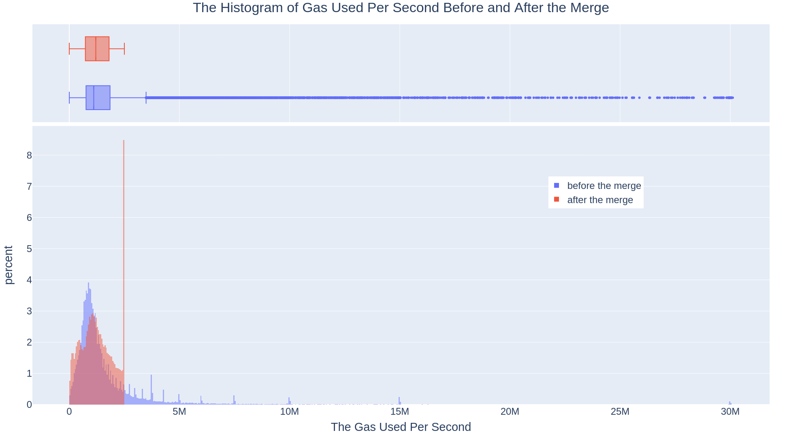

- Figure 20
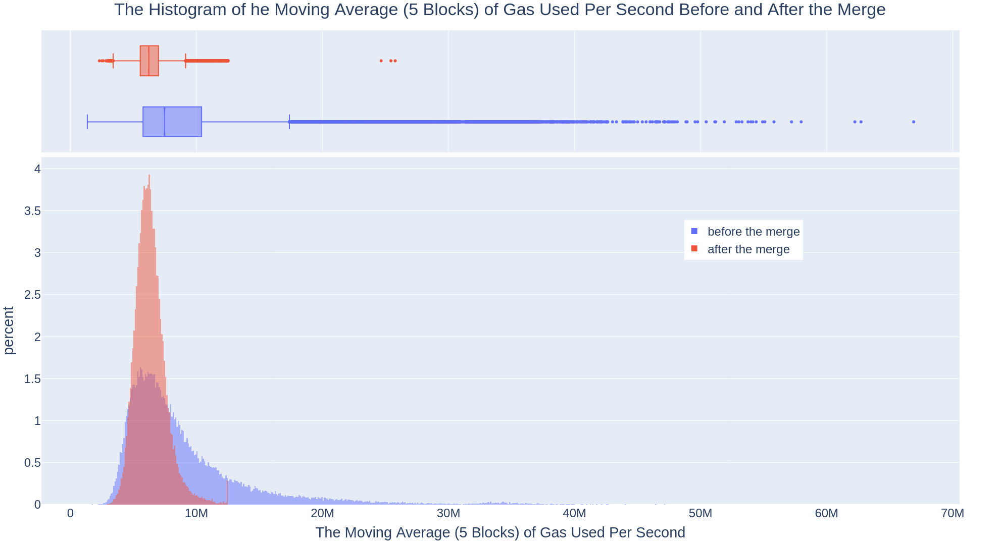


##### 1.3.2. Moving Aveage Smoothing

- Figure 21
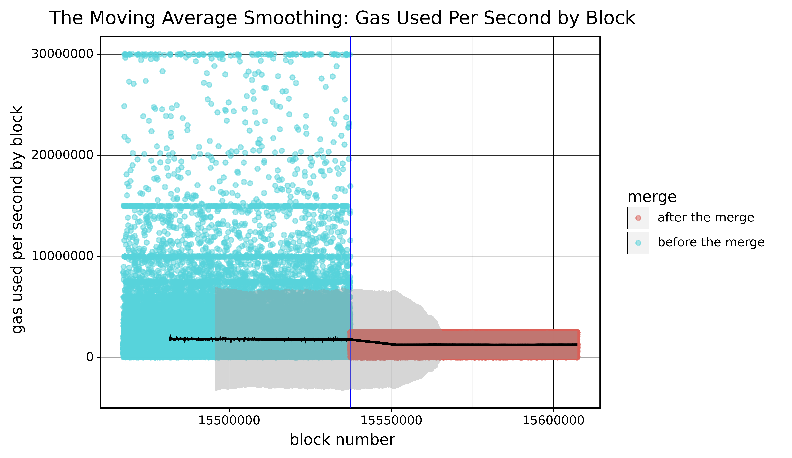

##### 1.3.3. Regression Discontinuity Design 
*Tables refer to the paper*

## Results 2: NFT Drops

### 2.1.Visualization

#### Figure 19:
HTML: [https://sunshineluyao.github.io/waiting-time-eip1559/figs/NFT/figN1](https://sunshineluyao.github.io/waiting-time-eip1559/figs/NFT/figN1)
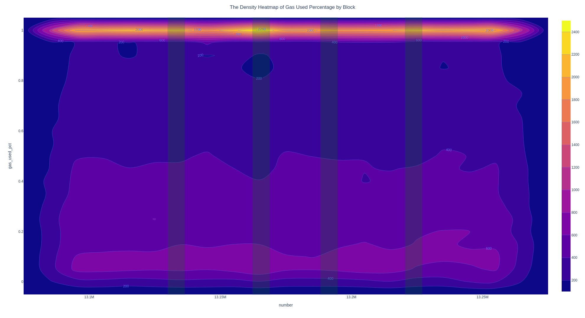

#### Figure 20:
HTML: [https://sunshineluyao.github.io/waiting-time-eip1559/figs/NFT/figN2](https://sunshineluyao.github.io/waiting-time-eip1559/figs/NFT/figN2)
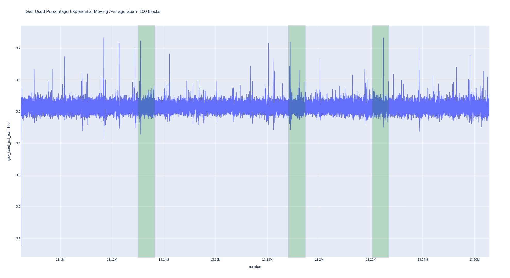

#### Figure 21:
HTML: [https://sunshineluyao.github.io/waiting-time-eip1559/figs/NFT/figN3](https://sunshineluyao.github.io/waiting-time-eip1559/figs/NFT/figN3)
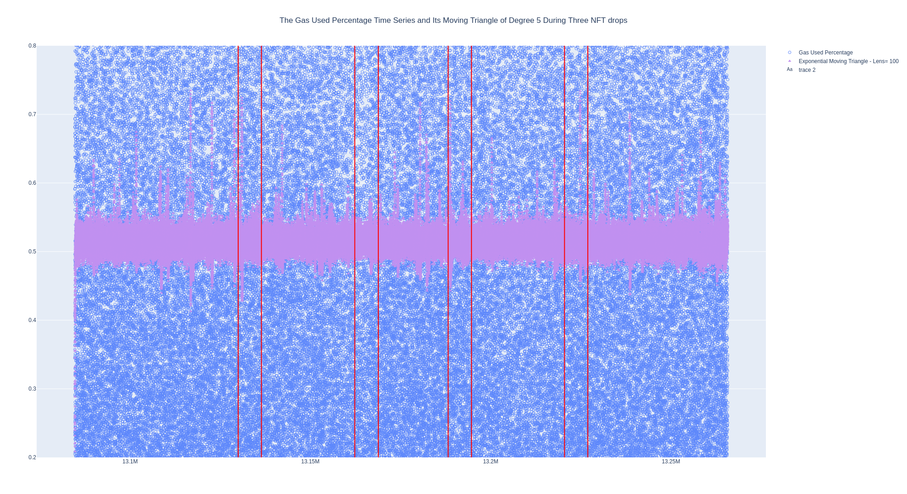

#### Figure 22:
HTML: [https://sunshineluyao.github.io/waiting-time-eip1559/figs/NFT/figN4](https://sunshineluyao.github.io/waiting-time-eip1559/figs/NFT/figN4)
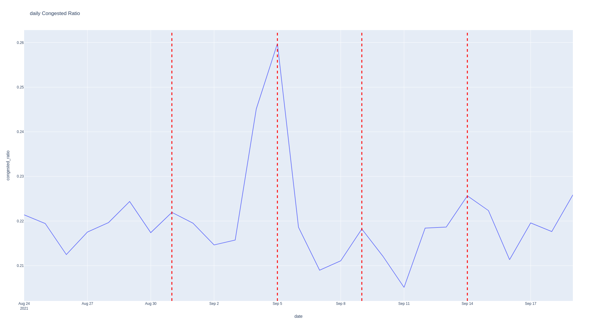

#### Figure 23:
HTML: [https://sunshineluyao.github.io/waiting-time-eip1559/figs/NFT/figN5](https://sunshineluyao.github.io/waiting-time-eip1559/figs/NFT/figN5)
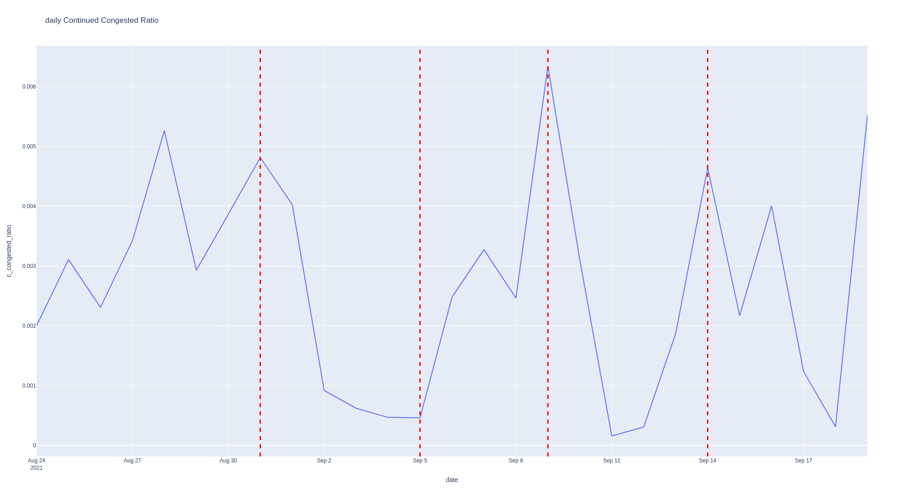

#### Figure 24:
HTML: [https://sunshineluyao.github.io/waiting-time-eip1559/figs/NFT/figN6](https://sunshineluyao.github.io/waiting-time-eip1559/figs/NFT/figN6)
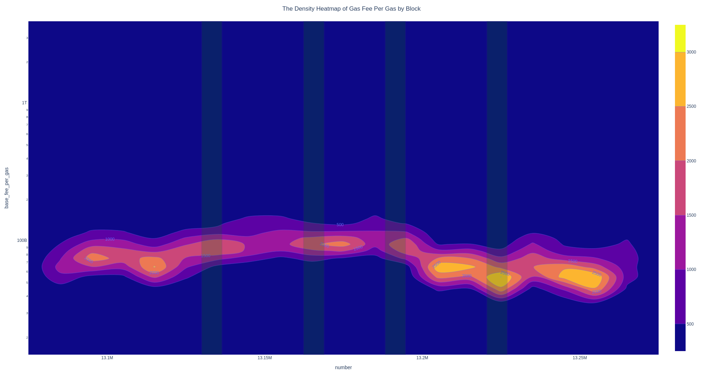


### 2.2. The Time Series Forecast

#### The congestion ratio

#### Figure 25:


#### Figure 26:


#### Figure 27:


#### Figure 28


#### The continued congestion ratio

#### Figure 29


#### Figure 30


#### Figure 31


#### Figure 32


### Result 3 Sanctioned Transactions in the Merge Dataset

## Sanctioned transactions with sanctioned address in the "from_address" (total_number=2)
| hash                                                               |   block_number | from_address                               | to_address                                 | OFAC sanctioned address interacted         |
|:-------------------------------------------------------------------|---------------:|:-------------------------------------------|:-------------------------------------------|:-------------------------------------------|
| 0xccb44ff691102ed30bf023cd6ee507f75feae2285c8e6a80a3af633fe69f9d19 |       15559539 | 0x3ad9db589d201a710ed237c829c7860ba86510fc | 0x4d981f56e1084c2661edf0e678863d8ada4fdf7c | 0x3ad9db589d201a710ed237c829c7860ba86510fc |
| 0xdef1a59eb486ffecf279774940eeb4131f57716bfd1130705816b6bf386724aa |       15584119 | 0x3ad9db589d201a710ed237c829c7860ba86510fc | 0x7ca7e53817cca98d997a7d70ac54c4e8fb66d24a | 0x3ad9db589d201a710ed237c829c7860ba86510fc |

## Sanctioned transactions with sanctioned address in the "to_address" (total_number=


### Appendix

#### The Transaction Count

- Figure 9: 
HTML: [https://sunshineluyao.github.io/waiting-time-eip1559/figs/merge/fig9](https://sunshineluyao.github.io/waiting-time-eip1559/figs/merge/fig9)
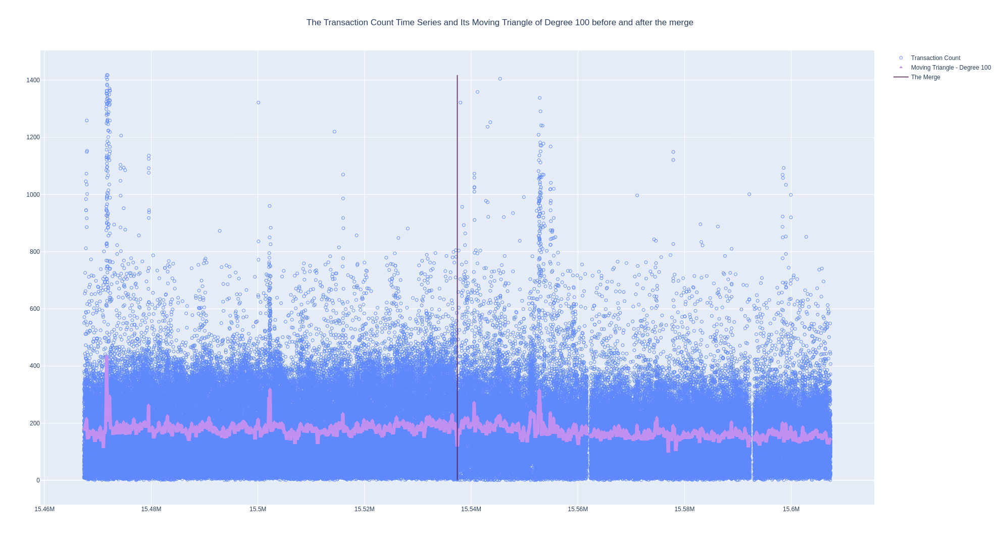

#### The Gas Used Percentage

#####  Visualization
- Figure 5

HTML: [https://sunshineluyao.github.io/waiting-time-eip1559/figs/merge/fig5](https://sunshineluyao.github.io/waiting-time-eip1559/figs/merge/fig5)

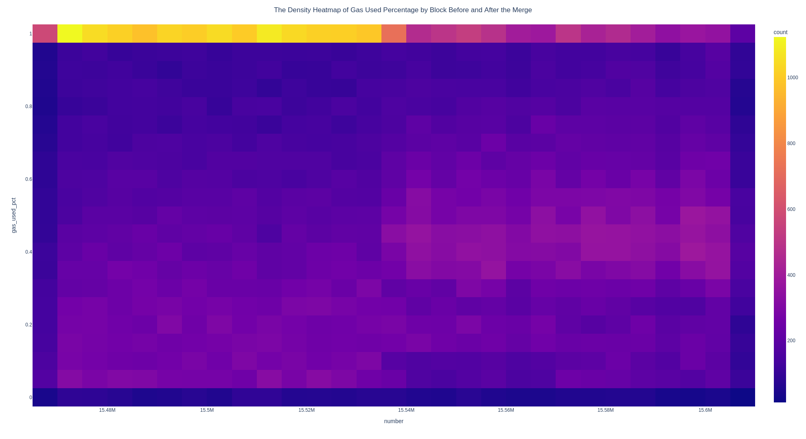

- Figure 6: 

HTML: [https://sunshineluyao.github.io/waiting-time-eip1559/figs/merge/fig6](https://sunshineluyao.github.io/waiting-time-eip1559/figs/merge/fig6)
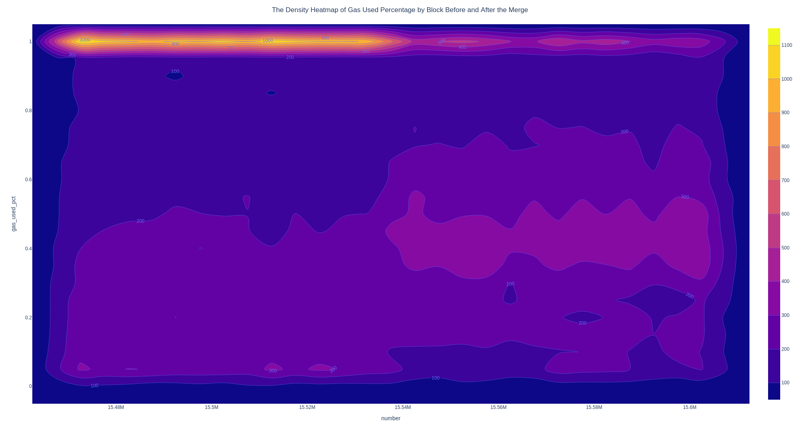

- Figure 7: 

HTML: [https://sunshineluyao.github.io/waiting-time-eip1559/figs/merge/fig7](https://sunshineluyao.github.io/waiting-time-eip1559/figs/merge/fig7)
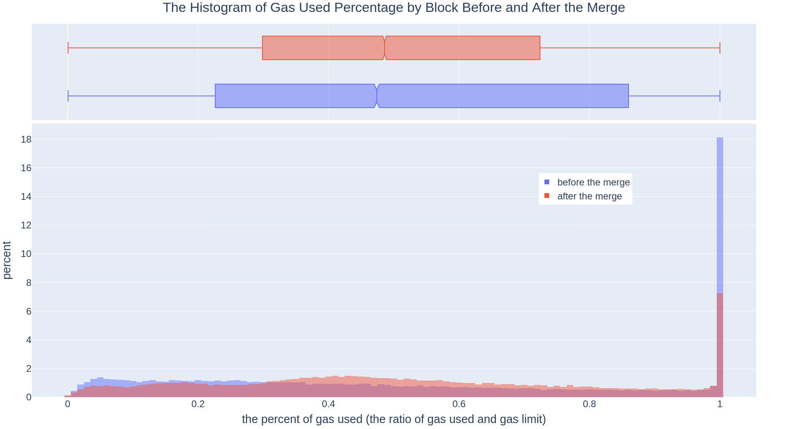

##### Moving Aveage Smoothing
- Figure 8: 

HTML: [https://sunshineluyao.github.io/waiting-time-eip1559/figs/merge/fig8](https://sunshineluyao.github.io/waiting-time-eip1559/figs/merge/fig8)
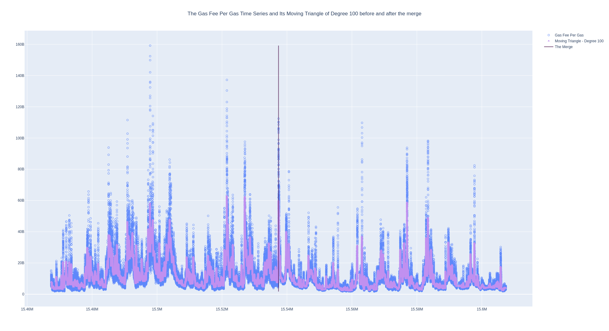

- Figure 15:
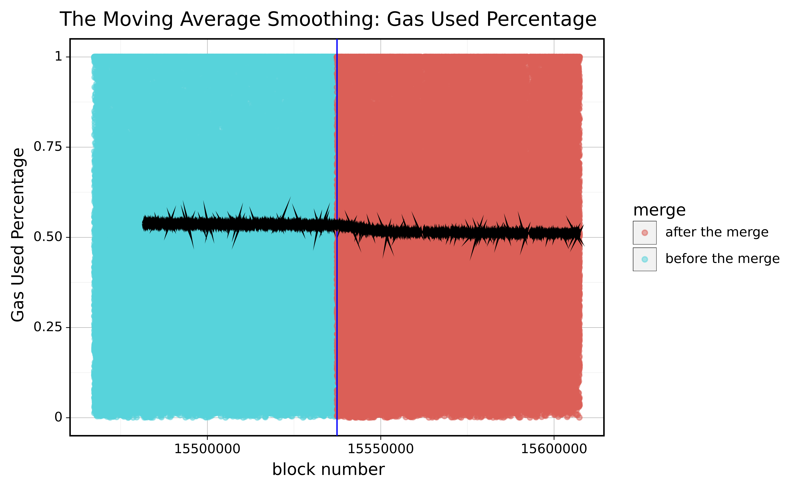

##### Regression Discontinuity Design 

*Tables refer to the paper* 


